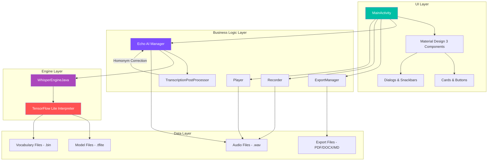
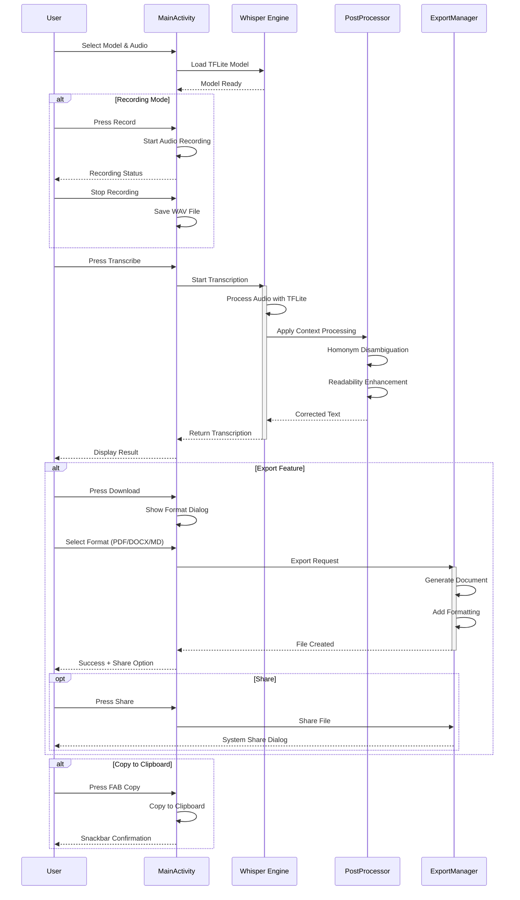

# 🎙️ Echo AI - AI-Powered Voice Transcription

**Developer**: [HectorTa1989](https://github.com/HectorTa1989)

An advanced Android application featuring offline speech-to-text powered by OpenAI's Whisper model. Built with modern Material Design 3, multi-format export capabilities, and intelligent context-aware transcription.

## ✨ Features

- 🎯 **Offline Speech Recognition** - Complete on-device processing using TensorFlow Lite
- 🎨 **Modern Material Design 3 UI** - Polished, gradient-based interface with dark mode support
- 📥 **Multi-Format Export** - Save transcriptions as PDF, DOCX, or Markdown
- 🧠 **Context-Aware Corrections** - Intelligent homonym disambiguation (their/there, your/you're, etc.)
- 🌍 **Multilingual Support** - Support for multiple languages and English-only models
- 🎙️ **Live Recording** - Real-time audio recording and transcription
- 📋 **Easy Sharing** - Copy to clipboard or share exported files
- ⚡ **Optimized Performance** - Efficient TFLite implementation for mobile devices

## 🏗️ System Architecture



## 🔄 Workflow



## 📂 Project Structure

```
EchoAI/
├── whisper_java/                          # Main Android application (Java)
│   ├── app/
│   │   ├── src/main/
│   │   │   ├── java/com/whispertflite/
│   │   │   │   ├── MainActivity.java      # Main UI controller
│   │   │   │   ├── asr/                   # Audio Speech Recognition
│   │   │   │   │   ├── Whisper.java      # Core Echo AI engine
│   │   │   │   │   ├── Recorder.java     # Audio recording
│   │   │   │   │   └── Player.java       # Audio playback
│   │   │   │   ├── engine/                # TFLite Engine
│   │   │   │   │   ├── WhisperEngine.java
│   │   │   │   │   └── WhisperEngineJava.java
│   │   │   │   └── utils/                 # Utility classes
│   │   │   │       ├── ExportManager.java          # Multi-format export
│   │   │   │       ├── TranscriptionPostProcessor.java  # Context reasoning
│   │   │   │       ├── WaveUtil.java      # Audio utilities
│   │   │   │       └── WhisperUtil.java   # Helper utilities
│   │   │   ├── res/
│   │   │   │   ├── layout/
│   │   │   │   │   └── activity_main.xml  # Material Design 3 UI
│   │   │   │   ├── values/
│   │   │   │   │   ├── colors.xml         # MD3 color palette
│   │   │   │   │   ├── themes.xml         # MD3 themes
│   │   │   │   │   └── strings.xml
│   │   │   │   ├── values-night/
│   │   │   │   │   └── themes.xml         # Dark theme
│   │   │   │   ├── drawable/
│   │   │   │   │   ├── gradient_background.xml
│   │   │   │   │   ├── button_primary.xml
│   │   │   │   │   ├── button_secondary.xml
│   │   │   │   │   └── card_background.xml
│   │   │   │   └── xml/
│   │   │   │       └── file_paths.xml     # FileProvider config
│   │   │   ├── AndroidManifest.xml
│   │   │   └── assets/
│   │   │       ├── *.tflite               # Whisper models
│   │   │       ├── *.bin                  # Vocabulary files
│   │   │       └── *.wav                  # Sample audio
│   │   └── build.gradle
│   └── build.gradle
│
├── whisper_native/                        # Native C++ implementation
│   └── (similar structure with NDK)
│
├── models_and_scripts/                    # Model generation tools
│   ├── generate_model.py                  # TFLite converter script
│   └── whisper_tflite_model_generation_and_test.ipynb
│
├── demo_and_apk/                          # Pre-built APKs
│   ├── WhisperASR.apk
│   └── Screenshot.jpg
│
├── README.md                              # This file
├── LICENSE.txt
└── privacy_policy.md
```

## 🚀 Getting Started

### Prerequisites

- Android Studio Arctic Fox or later
- Android SDK API 26 (Android 8.0) or higher
- Gradle 7.0+
- JDK 11

### Building the Application

1. **Clone the Repository**
   ```bash
   git clone https://github.com/HectorTa1989/EchoAI.git
   cd EchoAI/whisper_java
   ```

2. **Open in Android Studio**
   - Open Android Studio
   - Select "Open an Existing Project"
   - Navigate to `whisper_java` folder

3. **Sync Gradle**
   - Android Studio will automatically sync dependencies
   - Wait for the build to complete

4. **Prepare Model Files**
   
   The application requires Whisper TFLite model files. Place them in `app/src/main/assets/`:
   
   - `whisper-tiny.tflite` or `whisper-base.tflite` (model file)
   - `filters_vocab_multilingual.bin` (for multilingual models)
   - `filters_vocab_en.bin` (for English-only models)
   
   **Generate Models Using Python Script:**
   ```bash
   cd models_and_scripts
   pip install -r requirements.txt
   python generate_model.py
   ```

5. **Build APK**
   
   **Debug Build:**
   ```bash
   .\whisper_java\gradlew.bat assembleDebug
   ```
   
   **Release Build:**
   ```bash
   ./gradlew assembleRelease
   ```
   
   APK will be generated in `app/build/outputs/apk/`

6. **Install on Device**
   ```bash
   adb install app/build/outputs/apk/debug/app-debug.apk
   ```

## 📱 Usage Guide

### Basic Transcription

1. **Select Model**: Choose from available TFLite models in the dropdown
2. **Select Audio**: Choose an audio file or use recording
3. **Record** (Optional): Record new audio using the Record button
4. **Transcribe**: Press the Transcribe button to process audio
5. **View Results**: Transcription appears in the result card

### Export Transcriptions

1. After transcription is complete, click the **Download** button
2. Select your preferred format:
   - **PDF** - Professional document format
   - **DOCX** - Microsoft Word compatible
   - **Markdown** - Plain text with formatting
3. Choose to save or share the file

### Features Demonstration

- **Context Correction**: The app automatically corrects common homophones based on context
- **Copy to Clipboard**: Use the floating action button (FAB) at the bottom right
- **Dark Mode**: Automatically adapts to system theme
- **Multiple Models**: Switch between different Whisper model sizes

## 🧪 Technical Details

### Dependencies

```gradle
// UI Components
implementation 'com.google.android.material:material:1.12.0'
implementation 'androidx.coordinatorlayout:coordinatorlayout:1.2.0'

// TensorFlow Lite
implementation 'org.tensorflow:tensorflow-lite:2.14.0'
implementation 'org.tensorflow:tensorflow-lite-support:0.4.4'

// Document Generation
implementation 'com.itextpdf:itext7-core:7.2.5'          // PDF
implementation 'org.apache.poi:poi-ooxml:5.2.3'           // DOCX
```

### Homonym Correction Examples

The `TranscriptionPostProcessor` uses context-aware pattern matching to fix common transcription errors:

| Homophone Set | Context Examples |
|---------------|------------------|
| their/there/they're | "their house" ✓ vs "there is" ✓ |
| your/you're | "your phone" ✓ vs "you're going" ✓ |
| to/too/two | "go to school" ✓ vs "too much" ✓ |
| its/it's | "its color" ✓ vs "it's raining" ✓ |
| hear/here | "hear music" ✓ vs "come here" ✓ |

### Performance Benchmarks

| Model | Size | Inference Time* | Accuracy |
|-------|------|----------------|----------|
| whisper-tiny | ~40 MB | ~2-3s | Good |
| whisper-base | ~74 MB | ~4-6s | Better |
| whisper-small | ~244 MB | ~10-15s | Best |

*On mid-range Android device (Snapdragon 600 series)

## 🎨 UI Customization

The app uses Material Design 3 with customizable color schemes. Edit `res/values/colors.xml` to change the theme:

```xml
<color name="md_theme_primary">#00BFA5</color>
<color name="md_theme_secondary">#7C4DFF</color>
<color name="gradient_start">#00BFA5</color>
<color name="gradient_end">#7C4DFF</color>
```

## 📄 License

Copyright @Hector Ta

## 🙏 Acknowledgments

- **OpenAI Whisper** - State-of-the-art speech recognition model
- **TensorFlow Lite** - Efficient on-device ML inference
- **Material Design 3** - Modern Android UI framework
- **iTextPDF** - PDF generation library
- **Apache POI** - DOCX document processing

## 📞 Contact & Support

- **Developer**: [HectorTa1989](https://github.com/HectorTa1989)
- **Issues**: [GitHub Issues](https://github.com/HectorTa1989/EchoAI/issues)
- **Privacy Policy**: See [privacy_policy.md](privacy_policy.md)

## 🎯 Roadmap

- [ ] Add support for more languages
- [ ] Implement real-time streaming transcription
- [ ] Add speaker diarization
- [ ] Support for audio file formats beyond WAV
- [ ] Cloud backup integration
- [ ] Custom vocabulary support

---

**Made with ❤️ by [HectorTa1989](https://github.com/HectorTa1989)**

*Powered by OpenAI Whisper, TensorFlow Lite, and Material Design 3*
